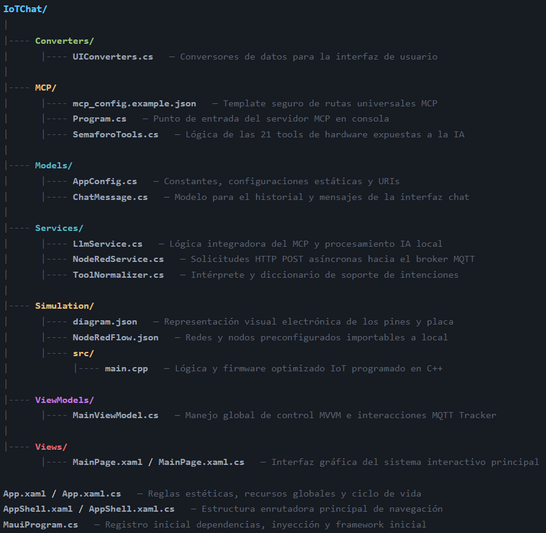
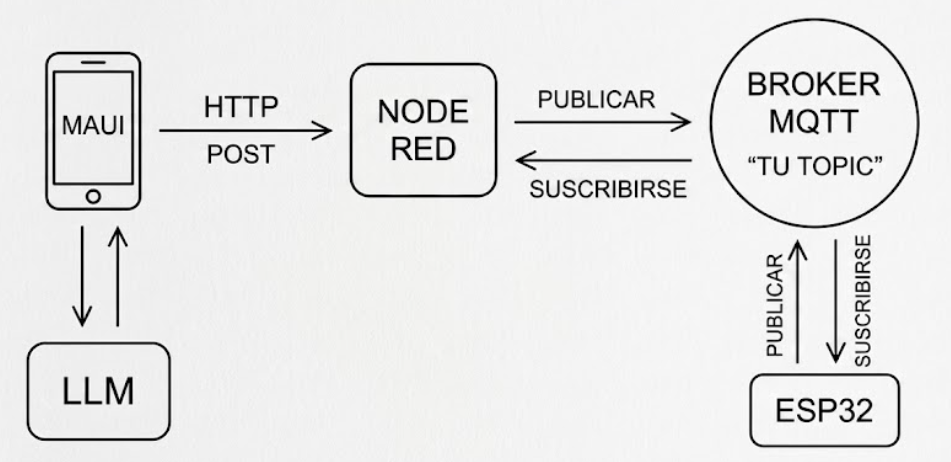
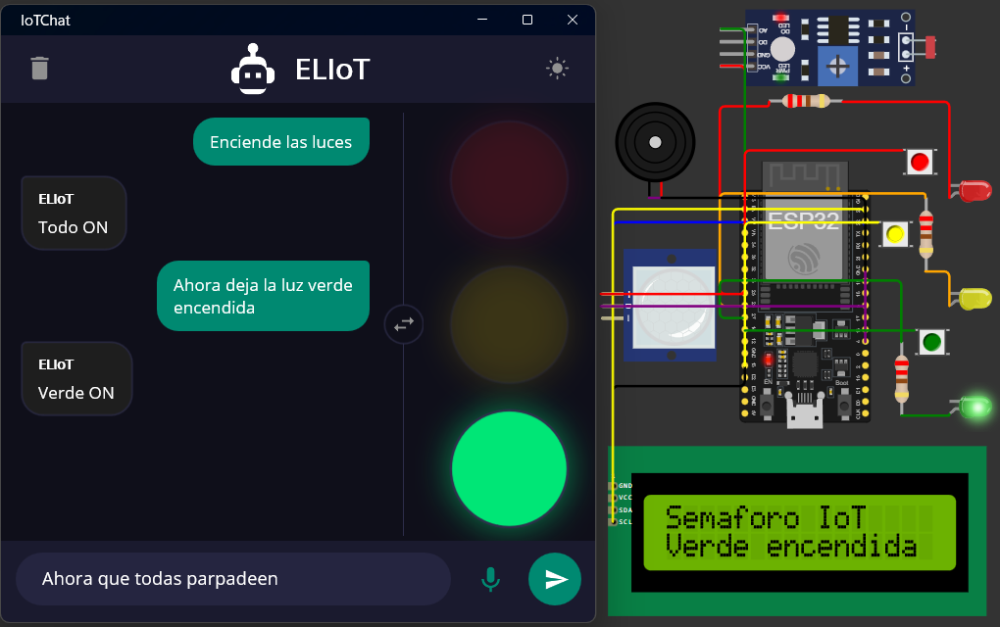
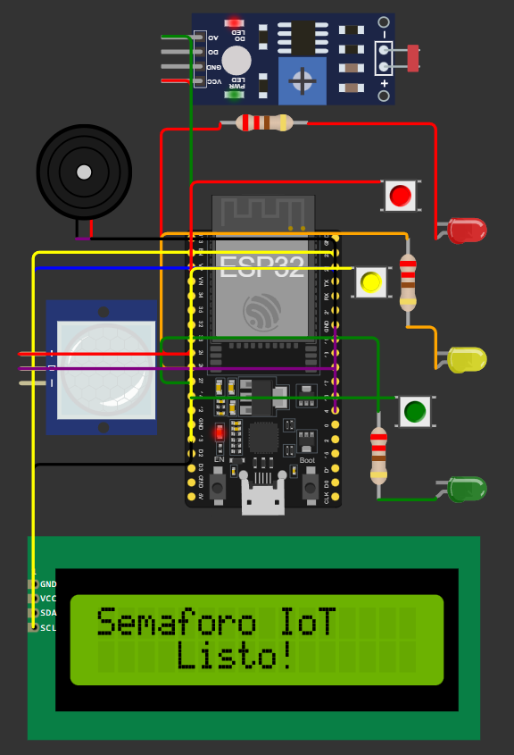

# IoTChat

Aplicación multiplataforma desarrollada en **.NET MAUI** que funciona como un sistema de control inteligente para un semáforo IoT. Integra un modelo de lenguaje local (LLM) mediante el protocolo **MCP (Model Context Protocol)** para procesar lenguaje natural, y se comunica en tiempo real con una placa **ESP32 simulada en Wokwi** a través de **Node-RED** y **MQTT**. 

Incluye respuesta por voz, transcripción de audio, telemetría en tiempo real y componentes físicos avanzados en la placa para una experiencia IoT completa.

---

## Índice

1. [Arquitectura](#arquitectura)
2. [Tecnologías y dependencias](#tecnologías-y-dependencias)
3. [Estructura del proyecto](#estructura-del-proyecto)
4. [Requisitos previos](#requisitos-previos)
5. [Instalación y configuración](#instalación-y-configuración)
6. [Uso de la aplicación](#uso-de-la-aplicación)
7. [Mejoras implementadas](#mejoras-implementadas)

---

## Arquitectura

El proyecto sigue una arquitectura distribuida que conecta la interfaz de usuario con hardware simulado mediante un puente de mensajería:

```
App MAUI  <-->  LLM (MCP Server)  <-->  Node-RED  <-->  MQTT Broker  <-->  ESP32 (Wokwi)
```

- **App MAUI**: Interfaz cliente con el modelo MVVM que gestiona el chat, la visualización del estado del semáforo y la captura de voz.
- **Servidor MCP**: Aplicación de consola en .NET que expone 21 herramientas de control sobre el semáforo para el LLM.
- **Node-RED**: Actúa como puente, recibiendo peticiones HTTP POST desde la App y publicando comandos MQTT.
- **Microcontrolador (ESP32)**: Ejecuta lógica local (modo nocturno, detección de movimiento, evaluación de botones físicos) y responde a comandos MQTT, publicando su estado (telemetría) de vuelta al broker.

---

## Tecnologías y dependencias

| Componente        | Tecnología                         |
| ----------------- | ---------------------------------- |
| Framework App     | .NET MAUI                          |
| Lenguaje          | C# / C++ (Arduino)                 |
| Protocolos        | MCP, MQTT, HTTP                    |
| Integración IA    | Model Context Protocol (MCP)       |
| MiddleWare        | Node-RED                           |
| Hardware Sim.     | Wokwi (ESP32)                      |

Paquetes clave:
- `ModelContextProtocol.Server` — Implementación del servidor MCP.
- `MQTTnet` — Cliente MQTT para recibir la telemetría en la App.
- `CommunityToolkit.Maui` — Servicios adicionales (conversión de texto a voz).
- `PubSubClient` (C++) — Cliente MQTT para el microcontrolador.

---

## Estructura del proyecto



---

## Requisitos previos

1. **.NET SDK** instalado (versión 10 o superior).
2. **Visual Studio** o **VS Code** con soporte para .NET MAUI.
3. **Node-RED** instalado y ejecutándose localmente (`http://localhost:1880`).
4. Extensión de **Wokwi** en VS Code (o cuenta en su plataforma web).
5. Un LLM local o servicio compatible con la especificación de herramientas.

---

## Instalación y configuración

### 1. Preparar la placa ESP32 (Wokwi)

1. Abre la carpeta `Simulation` en VS Code teniendo la extensión de Wokwi instalada.
2. Ejecuta la simulación (lee el archivo `diagram.json` y compila `main.cpp`).
3. La placa se conectará automáticamente a la red WiFi y se suscribirá al broker público de MQTT (`test.mosquitto.org`).

### 2. Preparar Node-RED

1. Inicia Node-RED en tu sistema.
2. Importa el flujo desde el archivo `NodeRedFlow.json` provisto.
3. Despliega el flujo. Esto habilitará un endpoint HTTP POST en `/encender` que publicará hacia el broker MQTT.

### 3. Ejecutar la App y el Servidor MCP

1. Ejecuta el script `Run.bat` desde Windows, el cual se encargará de compilar y lanzar la aplicación .NET MAUI.
2. El servidor MCP está configurado de manera independiente en la carpeta `/MCP` y puede ser consumido por clientes compatibles usando el archivo `mcp_config.example.json` (renombrándolo a `mcp_config.json` y configurando la ruta del proyecto).

---

## Uso de la aplicación



### Interacción principal



- **Comandos Naturales**: Escribe o proporciona por voz instrucciones como "Enciende la luz verde" o "Haz que el semáforo parpadee en rojo". La IA procesará la intención e invocará la herramienta correspondiente.
- **Sincronización Real**: Los gráficos del semáforo en la aplicación no cambian de forma inmediata al enviar la orden; cambian exclusivamente cuando el ESP32 confirma mediante telemetría MQTT que las luces físicas han cambiado, garantizando consistencia total.
- **Respuesta de Voz**: Si la orden se dio por micrófono, el sistema confirmará la acción completada usando voz sintetizada.

---

## Mejoras implementadas

Sobre el flujo IoT básico, se han implementado características adicionales tanto en el diseño de software como en la electrónica simulada de la placa:



- **Servidor MCP Integral**: Arquitectura desacoplada que cuenta con 21 herramientas que abarcan todas las combinaciones posibles de encendido, apagado y parpadeo. Incluye procesamiento local para evitar dependencias en la nube y un normalizador de comandos tolerante a variaciones léxicas.
- **Sensor de Luz (LDR) / Modo Nocturno**: Al detectar una disminución aguda de la luz ambiental, el sistema fuerza de manera autónoma un estado de precaución (parpadeo de luz amarilla), restaurando el control normal de día.
- **Sensor de Movimiento (PIR) / Alerta Inmediata**: Actúa como una validación de alta prioridad de seguridad. Al detectar movimiento, fuerza una luz roja intermitente bloqueando los demás estados temporalmente, para luego restaurar las luces a su condición previa.
- **Feedback Auditivo Automático**: Un buzzer (altavoz) piezoeléctrico en la placa emite un tono intermitente exclusivamente cuando la luz verde parpadea.
- **Interruptores Físicos Táctiles**: Integración de botones capacitivos de 6mm directamente vinculados a la placa para la manipulación manual de cada color. Al presionarlos, la aplicación actualiza su respectiva interfaz inmediatamente usando el canal de telemetría.
- **Pantalla LCD Informativa**: Mensajes de 16x2 integrados a lo largo de todos los flujos de software para proveer diagnósticos instantáneos durante el modo normal e interrupciones de los sensores de movimiento o luz.
- **Voz y Reconocimiento Multiplataforma**: Integración de capacidades del sistema nativo para escucha en el micrófono sin bibliotecas de terceros.